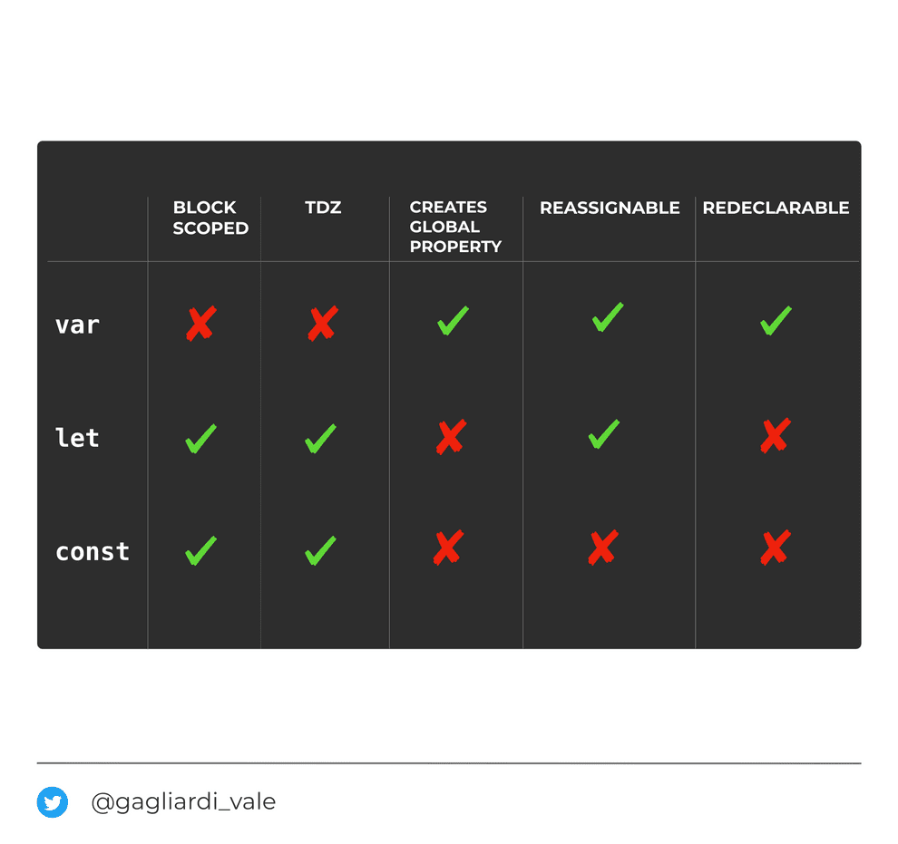

# Cheat sheet

- [Cheat sheet](#cheat-sheet)
  - [HTML](#html)
  - [JavaScript](#javascript)
  - [Loops](#loops)
  - [Generators](#generators)
    - [Generator Iterator](#generator-iterator)
    - [for..of](#forof)
  - [Testing](#testing)
  - [Version control](#version-control)
  - [SQL](#sql)
  - [Resources](#resources)

## HTML

- **Semantic markup**: when a tag usage is aligned with the meaning of the tag.
  - Example: the semantic meaning of an `h1` tag is that it is used to identify the most important
    header of a specific web page or section.
- **Two practices that enable semantic markup**:
  1. _HTML elements are used according to their intended purpose_: Use HTML tags correctly so that
     the markup is both human-readable and machine-readable.
  2. _Separation of content and presentation_: don't select HTML elements based on visual
     presentation. Instead, select HTML elements based on their semantic meaning, and then use CSS
     to define the visual presentation of the content.
- **Use tags correctly**:
  - _Document structure_: `header`, `footer`, `main`, `nav`, `aside`, `article`.
  - _Textual meaning_: `h1-h6`, `p`, `strong`, `code, `mark`, `cite`, `blockquote`, `time`.
  - _Media type_: `audio`, `video`, `picture`.
  - _Correlation tags_: `ul`, `figure`, `address`.

## JavaScript

- **Data types**: SBN NUS O B

  - String
  - Number
  - Boolean
  - null
  - undefined
  - Symbol
  - Object
  - BigInt

- **typeof**: returns the type of the passed value. `type of 42 -> number`

- Values can be of 2 types of data:

  - **Reference**: `typeof "object"`. Objects, arrays, functions, etc. Compared by their reference.
  - **Primitives**: data that is not an object and has no methods. Compared by their value. They're
    _immutable_, modifying them replaces the in-memory value. There are 7 primitive data types:
    `string`, `number`, `bigint`, `boolean`, `null`, `undefined`, and `symbol`.
    - `Symbol`: every symbol value is **unique**, used in private properties to avoid name clashes.

- **Undeclared, undefined and null**:

  - _undeclared_: variable doesn't exist (no identifier).
  - _undefined_: declared but not assigned a value.
  - _null_: value is `null` (explicitly stated).

- **Type coercion**: convert one type into another.

  - _Implicit coercion_:
    - String concatenation: number to string. Example: `"" + number`.
    - Operator automatically convert values. Example: `if (value1 < value2) {}`
  - _Explicit coercion_:
    - Use `!!`. Example: `if (!!students.length) {}`

- **Equality**: both operator do the same if the types are the same.

  - _Double equals_: allows coercion, different types (loose).
  - _Triple equals_: disallows coercion, same types (strict).

- **Falsey values**:

  - `false`.
  - `0`.
  - `0n`.
  - ` "", '', `` (empty string) `.
  - `null`.
  - `undefined`.
  - `NaN`.

- **NaN**: invalid numeric operation.

  - `Number.isNaN(something)`.

- **new**: creates new objects (instantiate) from a class.

  - Use new:
    - Object()
    - Array()
    - Function()
    - Date()
    - RegExp()
    - Error()
  - Don't use new: changes the type.
    - String()
    - Number()
    - Boolean()

- **Immutability**: immutable data cannot change its structure or the data in it. `Objects` and
  `arrays`, on the other hand, allow mutation, meaning the data structure can be changed.

- **Function expressions**: functions themselves are values, so they can be assigned to variables or
  passed as arguments to other functions, or returned from functions.

  - A function is a _first class citizen_ in JavaScript.
  - Example: variables that equal to functions, arrow functions, closures.

- **IFFEs**: stands for _Immediately-invoked function expression_.
  - It's a function that's called immediately after being defined.
  - A block of scope is created inside the IFFE.

```javascript
let teacher = 'Kyle'(function anotherTeacher() {
  let teacher = 'Suzy'
  console.log(teacher) // Suzy
})()

console.log(teacher) // Kyle
```

- **Callback**: a function passed into another function as an argument.

  - The function you’re passing the callback function to is called a _higher order function_.
  - _Uses_:
    - Abstraction over turning one value into another.
    - Delaying execution of a function until a particular time.
  - _Callback hell_: many nested callbacks.

- **Promise**: object that may produce a single value some time in the future. Represents the
  completion or failure of the operation. Specifically made for handling async operations.

  - _States_: pending, fulfilled, or rejected.
  - _Arguments_: a _callback function_:
    - This function is going to be passed two arguments, _resolve_ and _reject_.
  - Can be _chained_ using multiple `then()`. Each one returns a promise.

- **Async/await**: makes asynchronous code look like synchronous code.

  - `async` functions return a `Promise`.

- `bind, call and apply`:

  - Ways of explicitly binding the `this` keyword to a context.
  - Use `.bind()` when you want that function to later be called with a certain context, useful in
    events.
  - Use `.call()` or `.apply()` when you want to invoke the function immediately, with modification
    of the context.
    - A context is an object that replaces `this` keyword inside the function.

- **Event delegation**: instead of assigning an event handler to each element that is handled in a
  similar way, we put a single handler on their common ancestor, so when something triggers an event
  (like clicking) it _bubbles_ up to the parent.

  - Useful because event listeners are very expensive on the page because every time it re-renders
    it needs to be re-added to the DOM.
  - In the handler we get `event.target`, see where the event actually happened and handle it.
  - Instead of listening for a change on the inputs directly (the children elements), we should look
    for an HTML element that is going to be on the page when the page initially loads (the parent
    element).

- **Event bubbling or event propagation**: place an event listener on a single parent HTML element
  that lives above a HTML child, and that event listener will get executed whenever an event occurs
  on any of its child nodes — even if these node children are added to the page after the initial
  load!.

- **Prototypal inheritance**: all objects have a `prototype` property. If we try to access a
  property on an object and JS doesn't find, it will try to look for it in the `prototype`, and the
  `prototype`'s `prototype`. This is how JavaScript simulates inheritance.

  - _Get the prototype of an object_: use `Object.getPrototypeOf(<object>`.
  - _Determining if a property lives on the prototype_: use `<object>.hasOwnProperty`.
  - _Check if an object is an instance of a Class_: use `<object> instanceof <Class>`.

- `this`: refers to the current execution context, determined by how the function was called.

  - If the `new` keyword is used when calling the function, this inside the function is a brand new
    object.
  - If `apply`, `call`, or `bind` are used to call/create a function, `this` inside the function is
    the object that is passed in as the argument.
  - If a function is called as a method, such as `obj.method()` , `this` is the object that the
    function is a property of.
  - If a function is invoked as a free function invocation, meaning it was invoked without any of
    the conditions present above, this is the global object. In a browser, it is the `window`
    object. If in strict mode (`'use strict'`), this will be `undefined` instead of the `global`
    object.
  - If multiple of the above rules apply, the rule that is higher wins and will set the `this`
    value.
  - If the function is an ES2015 arrow function, it ignores all the rules above and receives the
    `this` value of its surrounding scope at the time it is created.

- **Closure**: a function inside another (parent) function, that remembers the context (and state,
  variables, methods, etc.) of its parent (when a function "remembers" the variables outside of it,
  even if it's passed elsewhere, like a callback).
  - Has access to its outer context (the parent's), but not the other way around.
  - Has access to _3 scopes_: local, the parent's and the global.
  - _Uses_:
    - Extends behavior of the parent function.
    - Hides implementation details.
    - Preserves values created in the parent function.
  - When do we have closures?
    - We must _have a nested function_ (function inside a function).
    - The nested function must _refer to a value defined in the enclosing function_.
    - The enclosing function must _return the nested function_.

```javascript
function makeAdder(x) {
  return function (y) {
    return x + y
  }
}

var add5 = makeAdder(5)
var add10 = makeAdder(10)

console.log(add5(2)) // 7
console.log(add10(2)) // 12
```



- **Hoisting**: variable and function declarations are moved to the top of the code.

  - The variable and function declarations are put into memory during the `compile phase`.
  - Declarations are initialized as `undefined`.

- **Declaration**: create new identifier (with `undefined`) in memory.
- **Initialization**: assign a value.

- **Scope**: defines where variables/functions are accesible (where to look for things).

  - _global_: available anywhere.
  - _function_: available inside the function.
  - _block_: avaiable inside the block (curly braces).

- **Variables**:

  - _variables created without var_: global scope.
  - _var_: function scoped. If you try to use a variable declared with `var` before the actual
    declaration, you’ll just get `undefined`.
  - _let_: block scoped. Protects the outer scope (encapsulation).
  - _const_: block scoped, IMMUTABLE.

- **Shallow vs deep copy**:
  - _Deep copy_: means that all of the values of the new variable are copied and _disconnected from
    the original variable_.
  - _Shallow copy_: means that certain (sub-)values are _still connected_ to the original variable.
  - **Note**: arrays and objects are stored only once when instantiated, and assigning a variable
    just creates a _pointer (reference)_ to that value. Changes in the copy trigger changes in the
    original.

```javascript
const a = 5

let b = a // this is the copy

b = 6

console.log(b) // 6
console.log(a) // 5

// Objects -> Shallow copy
const a = { name: 'John Doe' }

const b = a
b.name = 'Mary Jane'

console.log(b.name) // Mary Jane
console.log(a.name) // Mary Jane

// Objects -> Deep copy
const a = { name: 'John Doe' }

const b = { ...a } // Using the spread operator
const b = Object.assign({}, a) // Using Object.assign
const b = JSON.parse(JSON.stringify(a)) // Stringifying the object and then parsing it

b.name = 'Mary Jane'

console.log(a.name) // John Doe
console.log(b.name) // Mary Jane

// Arrays -> Deep copy
const a = [1, 2, 3]

const b = [...a] // Using the spread operator

b[1] = 4

console.log(a[1]) // 2
console.log(b[1]) // 4

// Arrays -> slice, map, filter, reduce -> return new arrays
// Arrays -> splice -> mutates the original array
```

- **Constructor**: defines and initializes objects and their features. Called when a class is
  initialized via new.

- `super()`: used to call its parent’s constructor and `super.<methodName>` to access its parent’s
  methods. This means we can use the parents properties and method in the children.

- **Worker**: used to off-load expensive tasks from the main thread to a different thread.
  - Helps with not blocking the UI, since JavaScript is single-threaded.

## Loops

- In JavaSCript there are `enumerable properties` and `iterable objects`.
  - **Enumerable properties**: the internal `enumerable` flag to true when we assign a property to
    an object. This is the default value.
  - **Iterable objects**: an object is iterable if it defines its iteration behavior.
    - Built-in types that are iterable include `Arrays`, `Strings`, `Sets`, and `Maps`.
    - An `object` is not iterable because it does not specify an `@iterator method`.
  - **Note**: in Javascript, all iterables are enumerables, but not all enumerables are iterables.
    If `typeof` is called and the answer yields `object`, then you can use a `for …in` loop.

```javascript
const authors = ['Jade', 'Dafe', 'John', 'Daniel']

typeof authors // returns "object" -> can use for..in

// using with a for in loop
for (const author in authors) {
  console.log(author)
}
// 0, 1, 2, 3

for (const author of authors) {
  console.log(author)
}
// Jade, Dafe, John, Daniel
```

- **for loops**: 3 statements -> initialize some kind of counter, condition, increment/decrement
  - `while` loops.
- **for...of**: used for `iterable objects` (`arrays`, NOT objects unless converted with `keys()`,
  `values()`, `entries()`) specially when length isn't known. Doesn't need to create index
  variables.
- **for...in**: used for `enumerable` properties in objects.
- **Array.forEach**: pass a functon and execute it on each item. Pass (value, index, object).

  - `Array.every, .some, .map, .filter, .reduce`

- **Note**: similarities and differences between `map` and `forEach`:
  - Both receive a callback function as an argument.
    - `Map` is a pure function, `forEach` mutates the array.
    - Neither directly _mutates_ the array, although the callback function may do so.
    - `map` applies the callback on each element, returning a new array with the results of applying
      the function. `forEach` executes it once for each array element.
    - `map` returns a new Array, `forEach` returns `undefined`.
  - **Chaining**: `map` can be chained, `forEach` can't.
  - **Performance**:
    - `map` on average performs better than `forEach`.
  - **Async**:
    - `forEach` and `map` perform the callback function asynchronously (i.e. it create 10 promises
      for an array of 10 elements) and can't be stopped.
    - Neither can be stopped when executed. If you might need to stop it, use a `for...of` loop.
  - **Tips**:
    - Use `map` if the data will be changed or used.
    - Use `forEach` if you don't need the returned array.

`slice`: returns a new array, _doesn't mutate_ the original. `splice`: _modifies_ original array.

## Generators

- Normal functions normally run to completion.
- **Generators** may be paused in the middle of running, one or many times, and resumed later,
  allowing other code to run during these paused periods.
- Inside the generator function, the `yield` keyword pauses the function from inside itself (it
  can't be paused from outside).
- Using `yield` is like making a _request_ for a value from outside the function.
- By default, the value of `yield` is `undefined`.
- Once a function has _paused_, it _can't resume on its own_ (an external control must be used to
  restart the generator).
- With normal functions, you get parameters at the beginning and a `return` value at the end. With
  generator functions, you send messages out with each `yield`, and you send messages back in with
  each restart.
- A generator function is defined by using the `*` special generator function type.
- **Note**: `yield` is an _expression_, not a _statement_, because when we restart the generator, we
  will send a value back in, and whatever we send in will be the computed result of that `yield`
  expression.

```javascript
function* foo() {
  var x = 1 + (yield 'foo')
  console.log(x)
}

/*
The yield "foo" expression will send the "foo" string value out when pausing the generator function at that point, and whenever (if ever) the generator is restarted, whatever value is sent in will be the result of that expression, which will then get added to 1 and assigned to the x variable.
*/
```

### Generator Iterator

- `Iterators` are a special kind of behavior (a design pattern actually, where we step through an
  ordered set of values one at a time by calling `next()` until all values have been returned.
- To step throught the values of a generator function, we need an `iterator` to be constructed.
- An `object` is returned when calling an iterator with a `value` property and a `done` boolean
  property.
- **Note**: calling the generator function in the normal way doesn't actually execute any of its
  contents.

```javascript
function* foo() {
  yield 1
  yield 2
  yield 3
  yield 4
  yield 5
}

// Create an iterator
var it = foo()

// Start iterating
const message = it.next()

// An object is returned
console.log(message) // { value:1, done:false }

console.log(it.next()) // { value:2, done:false }
console.log(it.next()) // { value:3, done:false }
console.log(it.next()) // { value:4, done:false }
console.log(it.next()) // { value:5, done:false }

// Calling it on the last value completes the generator function
console.log(it.next()) // { value:undefined, done:true }
```

- Another example:

```javascript
function* foo(x) {
  var y = 2 * (yield x + 1)
  var z = yield y / 3
  return x + y + z
}

var it = foo(5)

// note: not sending anything into `next()` here
console.log(it.next()) // { value:6, done:false }
console.log(it.next(12)) // { value:8, done:false }
console.log(it.next(13)) // { value:42, done:true }
```

### for..of

- ES6 supports running iterators to completion with the `for..of` loop.

```javascript
function* foo() {
  yield 1
  yield 2
  yield 3
  yield 4
  yield 5
  return 6
}

for (var v of foo()) {
  console.log(v)
}
// 1 2 3 4 5

console.log(v) // still `5`, not `6` :(
```

## Testing

- **Stubs**: fake objects that return a specific, _hard-coded result_.
  - Stubs _don't fail_ the test.
  - Stub is making sure a method returns the correct value.
- **Mocks**: smarter stub, tests pass through it and are **verified**.
  - _A mock is a stub_.
  - Mocks _can fail_ the test.
  - A stub with an `assertion` that the method gets called.
  - Makes sure certain methods are called.
  - Mock is actually _stepping into the method_ and making sure everything inside is correct before
    returning the correct value.
- _Note_: both are used to simplify testing behavior.
- **Test-driven development**:
  - Use tests as contracts that have to pass when adding functionality.
  - `requirements -> write test -> write enough code -> refactor`.

## Version control

- **Version control**: manages changes to information (documents, files, etc.). Uses a graph
  structure.
- **Distributed version control**: the repository and its full history is mirrored on every
  developer's computer.
- **Centralized version control**: code is centralized on a server.
- **Git**: distributed version control system that tracks changes in a codebase. Uses `hashes` to
  differentiate versions.
- **Branch**: portion of the codebase under development, separated from the main codebase.

## SQL

- **SQL**: stands for `Structured Query Language`. Language used to retrieve and manage data in a
  relational database.

- **Data Definition Language (DDL)**: defines data structures and database schemas. _Creates_ and
  _eliminates_ database objects (tables, indexes, users).

  - `CREATE`.
  - `ALTER`.
  - `DROP`.
  - `TRUNCATE`.

- **Data Manipulation Language (DML)**: used for _inserting_, _deleting_ and _updating_ data in a
  database.

  - `SELECT`.
  - `INSERT`.
  - `UPDATE`.
  - `DELETE`.

- **Data Control Language (DCL)**: deals with _authorization_.

  - `GRANT`.
  - `REVOKE`.

- Types:

|          |           |        |
| -------- | --------- | ------ |
| smallint | character | bigint |
| int      | boolean   | uuid   |
| bigint   | date      | enum   |
| decimal  | json      | array  |
| numeric  | real      |        |

- Keys:

  - _Primary key_: unique value that identifies a record in a table.
  - _Foreign key_: value used to access a record from another table.
  - _Unique key_: unique identifier of a record in a table.

- `JOINS`: combines records from two or more tables by using common values.
  - `INNER JOIN`: intersection of both tables. Returns rows when there is a match in both tables.
  - `LEFT OUTER JOIN`: returns all rows from the left table, if there are no matches in the right
    table they're returned as `null`.
    - To get only rows from the left table but not the right table use the `WHERE` clause.
  - `RIGHT OUTER JOIN`: returns all rows from the right table, if there are no matches in the left
    table they're returned as `null`.
    - To get only rows from the right table but not the left table use the `WHERE` clause.
  - `FULL OUTER JOIN`: returns rows when there is a match in one of the tables. Combines rows of
    both left and right joins.
  - `CROSS JOIN`: returns every row of the first table with every row of the second table. Can
    result in large tables.

```sql
--INNER JOIN
SELECT table1.column1, table2.column2...
FROM table1
INNER JOIN table2
ON table1.common_field = table2.common_field;

--LEFT OUTER JOIN
SELECT table1.column1, table2.column2...
FROM table1
LEFT OUTER JOIN table2
ON table1.common_field = table2.common_field;

--RIGHT OUTER JOIN
SELECT table1.column1, table2.column2...
FROM table1
RIGHT OUTER JOIN table2
ON table1.common_field = table2.common_field;

--FULL OUTER JOIN
SELECT table1.column1, table2.column2...
FROM table1
FULL OUTER JOIN table2
ON table1.common_field = table2.common_field;

--CROSS JOIN
SELECT table1.column1, table2.column2...
FROM table1
CROSS JOIN table2;
```

## Resources

- [What Is Semantic HTML and Why You Should Use It](https://www.lifewire.com/why-use-semantic-html-3468271)
- [What On Earth Is Semantic Markup? (And Why Should You Learn To Write It) »](https://html.com/semantic-markup/#What_is_Semantic_Markup)
- [Understanding Async Await | CSS-Tricks](https://css-tricks.com/understanding-async-await/)
- [The Differences Between forEach() and map() that Every Developer Should Know](https://www.freecodecamp.org/news/4-main-differences-between-foreach-and-map/)
- [testing - What's the difference between a mock & stub? - Stack Overflow](https://stackoverflow.com/questions/3459287/whats-the-difference-between-a-mock-stub)
- [Version control - Wikipedia](https://en.wikipedia.org/wiki/Version_control)
- [Distributed version control - Wikipedia](https://en.wikipedia.org/wiki/Distributed_version_control)
- [Git - Wikipedia](https://en.wikipedia.org/wiki/Git)
- [Data definition language - Wikipedia](https://en.wikipedia.org/wiki/Data_definition_language)
- [Data manipulation language - Wikipedia](https://en.wikipedia.org/wiki/Data_manipulation_language)
- [A Visual Explanation of SQL Joins](https://blog.codinghorror.com/a-visual-explanation-of-sql-joins/)
- [PostgreSQL Joins: A Visual Explanation of PostgreSQL Joins](https://www.postgresqltutorial.com/postgresql-joins/)
- [Understanding Immutability in JavaScript | CSS-Tricks](https://css-tricks.com/understanding-immutability-in-javascript/)
- [Making Sense of the Tricky Parts of JavaScript - YouTube](https://www.youtube.com/watch?v=tiRhFGnCltw)
- [When do you need "bind()"? Indirect vs Direct JavaScript Function Execution Tutorial - YouTube](https://www.youtube.com/watch?v=fP_kA90DgIU)
- [How to differentiate between deep and shallow copies in JavaScript](https://www.freecodecamp.org/news/copying-stuff-in-javascript-how-to-differentiate-between-deep-and-shallow-copies-b6d8c1ef09cd/)
- [An overview of technical differences between loops in JavaScript - LogRocket Blog](https://blog.logrocket.com/technical-differences-between-loops-javascript/)
- [Primitive vs Reference Values in JavaScript - YouTube](https://www.youtube.com/watch?v=39_swwtNJgw)
- [Python Closures: How to use it and Why?](https://www.programiz.com/python-programming/closure)
- [var, let, and const in JavaScript: a cheatsheet.](https://www.valentinog.com/blog/var/)
- [5 Awesome JavaScript Promise Tricks](https://davidwalsh.name/javascript-promise-tricks)
- [Closures Explained in 100 Seconds // Tricky JavaScript Interview Prep - YouTube](https://www.youtube.com/watch?v=vKJpN5FAeF4)
- [JavaScript object immutability: Object.freeze vs. Object.seal - LogRocket Blog](https://blog.logrocket.com/javascript-object-immutability-object-freeze-vs-object-seal/)
- [Methods for deep cloning objects in JavaScript - LogRocket Blog](https://blog.logrocket.com/methods-for-deep-cloning-objects-in-javascript/)
